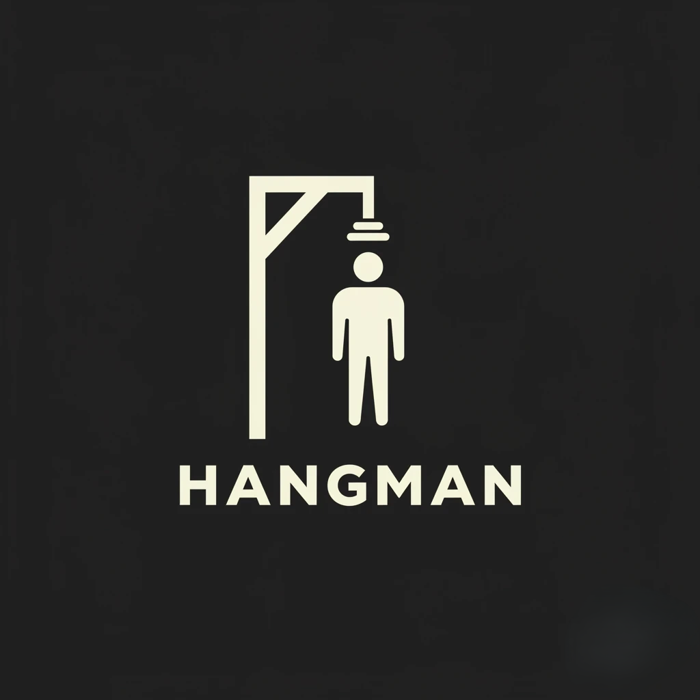
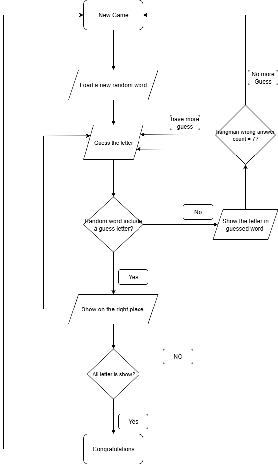

# The Hangman Game

[View website on GitHub Pages](https://fadam430.github.io/hangman/)

# Table Content

>1. [Overview](#overview)
>2. [UX](#ux)
>    1. [Strategy](#strategy)
>    2. [Scope](#scope)
>    3. [Structure](#structure)
>    4. [Skeleton](#skeleton)
>    5. [Surface](#surface)
>3. [Features](#features)
>    1. [Existing Features](#existing-features)
>    2. [Future Feature Considerations](#future-feature-considerations)
>4. [Technologies Used](#technologies-used) 
>5. [Testing](#testing)
>6. [Deployment](#deployment)
>    1. [How this Project was Deployed](#how-this-project-was-deployed)
>    2. [How to Run this Project in your Browser](#how-to-run-this-project-in-your-browser)
>    3. [How to Run this Project Locally](#how-to-run-this-project-locally)
>7. [Troubleshooting](#troubleshooting)
>8. [Credits](#credits)
>    1. [Content](#content)
>    2. [Media](#media)
>    3. [Code](#code)
>9. [Acknowledgements](#acknowledgements)
>10. [Disclaimer](#disclaimer)

# Overview

The Hangman Game is a browser-based word guessing game built using HTML, CSS, and JavaScript.
Players attempt to guess a hidden word by choosing letters. Each incorrect guess draws part of a hangman.
The game ends when the word is fully guessed or the hangman drawing is complete.

A landing page an introduction to the game.
A clean, responsive interface suitable for both desktop and mobile.

# UX 

## User Goals

* Play an easy-to-understand word guessing game.

* Receive clear feedback on progress.

* Enjoy a visually appealing but not overly complex design.

## Design Considerations

* Landing page: Central “New Game” button for quick access.

* Game screen: Clear letter display and interactive keyboard.

* Colors & Layout: Dark Brown-to-Yellow gradient for energy and fun.

**User Stories*** 

1. As a player, I want to understand the rules quickly before playing.

2. As a player, I want the main button to be easily noticeable.

3. As a player, I want to know how many guesses I have left.

4. As a player, I want the game to work well on my phone.

# Strategy

## Primary Goal:

**Deliver a fun, simple hangman game with smooth gameplay and a visually appealing interface.**

## Target Audience:

* Casual players looking for quick entertainment.

* Students or beginners learning JavaScript game development.

## Success Criteria:

* Easy to start a new game.

* Clear and responsive interface.

* No confusing navigation.

# Scope

## In Scope:

* Landing page with short instructions and start button.

* Random word selection.

* On-screen clickable keyboard.

* Hangman drawing updates for wrong guesses.

* Win/lose detection and display.

* Restart option.

# Structure

**The game consists of two main views**:

* Landing Page

* Introduction to the game.

* “New Game” button at center.

**Game Screen**

* Hangman drawing area at the top.

* Word display (underscores → revealed letters).

* On-screen keyboard.

* Status message and restart option.

* Navigation between these views is handled in JavaScript.

# Skeleton

## Logic Flow

## Wireframe Concept:
[mobile version](./assets/images/wireframe/hangman%20mobile%20version.png) 
[mobile landing page](./assets/images/wireframe/landing%20page%20mobile.png) 
[mobile win/lose pop up ](./assets/images/wireframe/hangman%20mobile%20version%20pop%20up.png) 
[tablet version](./assets/images/wireframe/hangman%20tablet%20version%20.png) 
[tablet landing page](./assets/images/wireframe/landing%20page%20tablet.png) 
[tablet win/lose pop up ](./assets/images/wireframe/hangman%20tablet%20version%20%20pop%20up.png) 
[desktop version](./assets/images/wireframe/hangman%20desktop%20version.png) 
[desktop landing page](./assets/images/wireframe/landing%20page%20PC.png) 
[desktop win/lose modal](./assets/images/wireframe/hangman%20desktop%20version%20modal%20pop%20up.png) 

# Surface

The light theme uses dark-brown and yellow accents, consistent with a modern game brand. Typography is bold and legible, with iconography for quick scanning.

Color Palette: [Color](https://colorhunt.co/palette/3b060a8a0000c83f12fff287)

## Visual Choices:

* Colors: Gradient background (`#C83F12` orange → `#FFF287` yellow).

* Buttons: Same gradient as background, rounded edges.

* Font: Clean sans-serif for readability.

# Features

## Existing Features

* Landing page with instructions and “Go to Game” button.

* Responsive layout for desktop and mobile.

* Consistent color theme.

* Future Feature Considerations

* Animations for letter reveals.

## Future-feature-considerations

* Leaderboard

* Difficulty levels(easy, medium, hard)

* Sound when word guess right or wrong

# Technologies Used

* HTML5 

* CSS3 

* JavaScript

* Git for version control

* Balsamiq (for wireframing and prototyping)

* Jest for testing
## Testing

Testing documentation [TEST.md](TEST.md).

# Deployment

## How this Project was Deployed

This project was deployed to GitHub pages via the following steps:

1. Log into [GitHub](https://GitHub.com/).
2. From the list of Repositories, select [fadam430/hangman](https://github.com/fadam430/hangman/).
3. From the Repositories sub-headings, select "Settings".
4. Under "Options", the first category of settings, scroll down to the GitHub Pages section.
5. From the dropdown list under the "Source" heading, select "master".
6. A second drop-down menu that appears should remain as the default value, "/root".
7. Press Save. 
8. On Page refresh, scroll back down to the GitHub Pages section, and the link to the deployed site will be available in a green sub-section with a tick icon next to it.

## How to Run this Project in your Browser

1. Install the [Brave](https://brave.com/download/) or [Firefox](https://www.mozilla.org/en-GB/exp/firefox/new/) browser.
2. Install the applicable [GitPod](https://www.gitpod.io/docs/browser-extension/) Browser Extensions for your chosen browser.
4. Create a [GitHub](https://GitHub.com/join) account. 
3. Log in to [Gitpod](https://gitpod.io/login/) using your GitHub account.
4. Visit Game Square [GitHub Repository](https://fadam430.github.io/hangman/).
5. Open the repository in Gitpod:
    * Click the green "Gitpod" icon at the top of the Repository.
6. A new workspace will open with the current state of the master branch. Any changes made to the master branch after this point will not be automatically updated in your Gitpod Workspace.

## How to Run this Project Locally

1. Visit Game Square [GitHub Repository](https://fadam430.github.io/hangman/).
2. Click the "Code" dropdown box above the repository's file explorer. 
3. Under the "Clone" heading, click the "HTTPS" sub-heading.
4. Click the clipboard icon, or manually copy the text presented: `https://github.com/fadam430/hangman.git`
5. Open your preferred IDE (VSCode, Atom, PyCharm, etc).
6. Ensure your IDE has support for Git, or has the relevant Git extension.
7. Open the terminal, and create a directory where you would like the Repository to be stored.
8. Type `git clone` and paste the previously copied text (`https://github.com/fadam430/hangman.git`) and press enter.
9. The Repository will then be cloned to your selected directory. 

## Troubleshooting

### Challenge 1: 

**Handling Large Dictionary Data**

Initially, I attempted to use a comprehensive dictionary JSON file that included not only words but also their descriptions and meanings. While detailed, this resulted in an excessively large file that was impractical to extract from and too heavy to display efficiently within the game environment.

### Solution: 

**Custom Word JSON**

To address this, I created a custom JSON file that contained only the words required for gameplay, without additional descriptions. The word list was generated with the assistance of ChatGPT, ensuring variety while keeping the file lightweight. This streamlined approach allowed me to efficiently extract words and display them during gameplay without performance issues.

### Challenge 2: 

**Automation Testing Compatibility**

During automation testing, I faced compatibility issues because the testing framework (Jest) uses ES6+ syntax, while my initial implementation was written in legacy JavaScript (ES5). This mismatch caused errors and prevented the tests from running correctly.

### Solution: 

**Transition to ES6+**

To resolve this, I refactored the codebase to follow modern ES6+ standards, including the use of const and let for variable declarations, arrow functions, and template literals. Aligning the project with ES6+ not only resolved the compatibility problem with Jest but also improved code readability, maintainability, and scalability for future development.

# Credit

## Content

 All text and looks idea was mine, but I boosted up for ClaudeAI and Chat GPT. Game titles and descriptions used for demo purposes and it's fiction.

## Media

* The hangman  game images and logo made by one of my Friend.
* The Javascript content ClaudeAi help to troubleshoot and give suggestion how to do.

## Code
 
* HTML: used by basic structure
* CSS: container for game page, links  [W3school](https://www.w3schools.com/)
* Icons: generate from Chat GPT
* README document inspired by My [Milestone project1](https://github.com/fadam430/game-square/blob/main/README.md?plain=1) 
* TESTING document inspired by 
* Font: I used basic font 'Arial', sans-serif
* Javascript: written by me and generated by ChatGPTs

# Acknowledgements

 Thanks to Me and My Mentor whom continuously review my work and give me negative and positive feedback.

# Disclaimer

 This is a fictional project created for educational and portfolio purposes. No real transactions or game inventory is hosted or processed.

